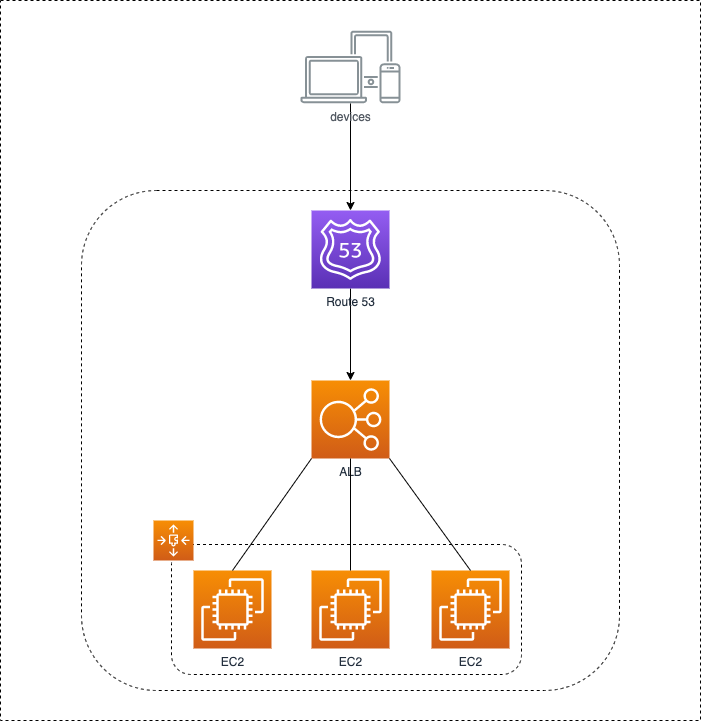

# awesome-app
#### aws - app modernization webinar
___


An awesome company has an awesome website but is not very happy with its setup:

- machines are hard to provision (installers are on a s3 bucket, source code on git)
- boot time takes long
- many components to setup (ssl, autoscaling-groups, EC2s, ALB)
- updates are done manually
- auto-scaling is not fast enough 




The company is looking for a solution that allows them to have:

- Faster deployments
- Faster auto-scaling  
- Infrastructure as Code
- Fewer resources to manage  
- Continuous Integration
- Continuous Deployment
- Monitoring Solution

## Proposed solution:

### App Runner

- Serverless - Run your code without thinking on infrastructure
- Pay for what you use
- No need to worry about ALB or SSL
- Managed Autoscaling


### Infrastructure as Code
- cdk 

### CI/CD
- Codebuild

### Monitoring
- Cloudwatch


---

## Requirements:
- python 3.8
- nodejs 13
- npm  
- aws-cdk
- aws-cli
- docker 
- docker-compose

## How to build this app
- start by creating a python virtualenv at the project root folder 
```
virtualenv -p python3.8 venv
```
- go to /app and install the application
```
npm install
```
- test and run the application
```
npm test
npm start
```
- run the docker image 
```
docker-compose up --build
```
## Deploy the infrastructure
- activate the virtualenv
```
source venv/bin/activate
```  
- move to /infra folder and install the requirements
```
pip install -r requirements.txt
```
- bootstrap the cdk application
```
cdk bootstrap
```
- check the plan
```
cdk diff
```
- deploy
```
cdk deploy --all
```

##Feel free to drop me an email!

### bruno.fitas@devoteam.com

# Thanks


